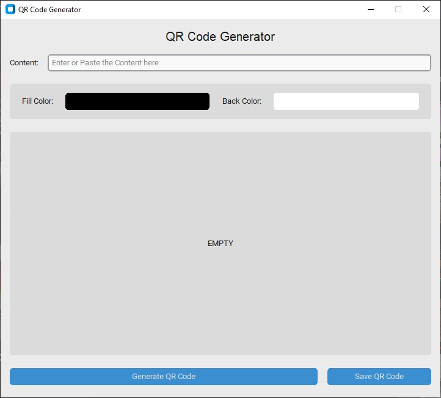
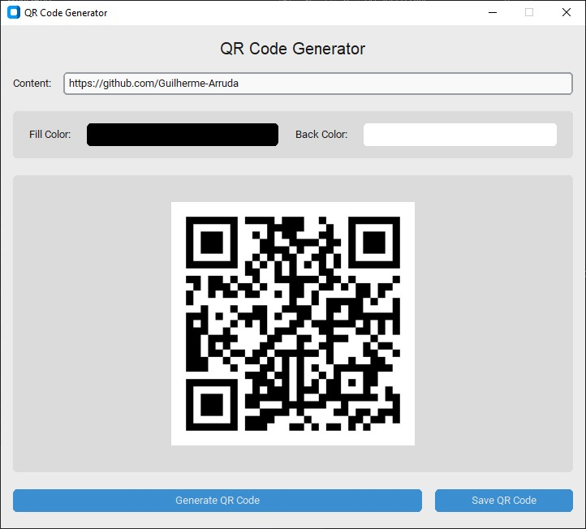
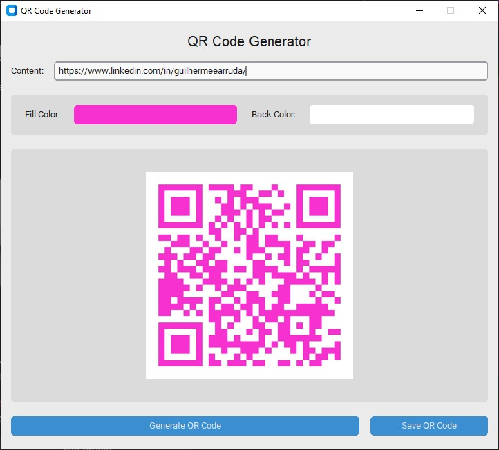
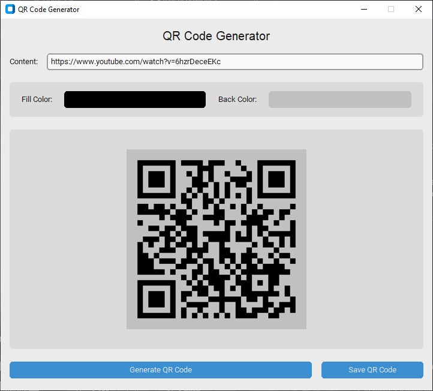

# QR Code Generator 

QR Code Generator built with Python and CustomTkinter for GUI. <br>
You can convert any text entry into a QR code. The generated QR code can be saved on the local machine as a PNG file.
 
## Screenshots

<p width='100%' align='center'>
  
  
</p>
<p width='100%' align='center'>
  
  
</p>

## 🚀 Getting Started

To run the project in your machine you can clone this repository locally in a directory of your choice using:

```
git clone https://github.com/Guilherme-Arruda/QR-Code-Generator.git
```

After cloning you need to install all dependencies using:

```
pip install -r requirements.txt  
```

Then you can finally run the project using:

```
python main.py
```

## 📄 License

This project is under MIT license - see the file [LICENSE.md](https://github.com/Guilherme-Arruda/QR-Code-Generator/blob/master/LICENSE) for details.

---

##### Coded with love by Guilherme Arruda ♥️